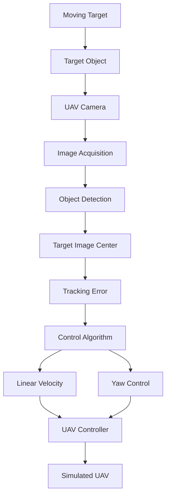
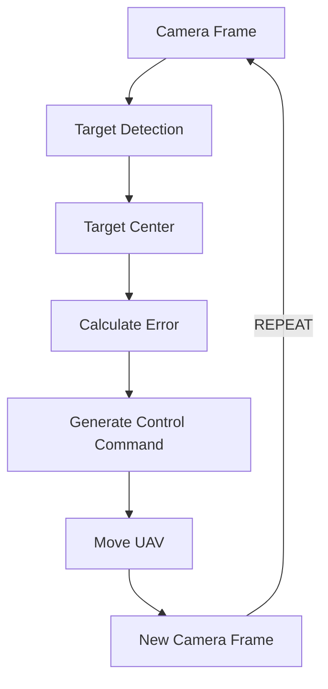
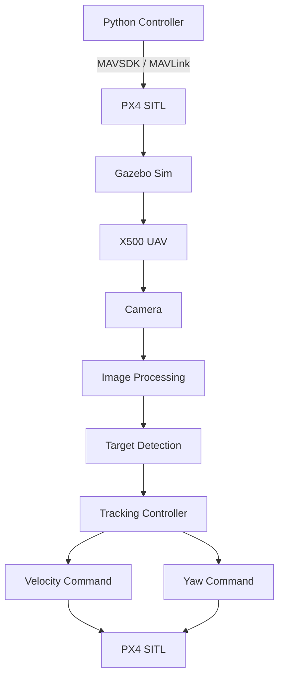

# UAV Object Tracking and Following System

## Drones_S5_AB12_Integrated_UAV_target_tracking


---

## Team Members

| Name | Roll Number | Email |
|---|---|---|
| Siddharth sankar U | CB.SC.U4AIE24151 | cb.sc.u4aie24151@cb.students.amrita.edu |
| E G Aadhijith | CB.SC.U4AIE24113 | cb.sc.u4aie24113@cb.students.amrita.edu |
| Roahiyaa | CB.SC.U4AIE24043 | cb.sc.u4aie24043@cb.students.amrita.edu |
| Vishnu vardan | CB.SC.U4AIE24159 | cb.sc.u4aie24159@cb.students.amrita.edu |
| Architha Rajasekar | CB.SC.U4AIE24009 | cb.sc.u4aie24009@cb.students.amrita.edu |

---

# Abstract

This project presents the development and simulation of a vision-based
object tracking and following system for an unmanned aerial vehicle (UAV).

The system investigates the ability of a simulated drone to detect a
target using an onboard camera, estimate the target's position within
the camera image, and generate control commands that allow the UAV to
follow and center the target.

Two simulation environments were explored during development:

1. PyBullet
2. PX4 SITL with Gazebo Sim

The PyBullet environment was used for rapid development and testing of
the tracking and control algorithms, while PX4 SITL and Gazebo were used
to investigate a more realistic flight-control architecture.

The project combines computer vision, image processing, camera geometry,
UAV control, and external flight-control interfaces.

---

# 1. Introduction

Unmanned Aerial Vehicles have become increasingly important in
surveillance, inspection, search and rescue, autonomous navigation,
agriculture, and aerial robotics.

One important capability for autonomous UAVs is the ability to detect
and follow a moving target using onboard sensors.

In this project, the UAV observes a target using a camera mounted on
the simulated drone. The detected target location is represented in
image coordinates, and the tracking error between the target and the
camera center is used to generate control commands.

The overall objective is to investigate a complete vision-based UAV
tracking pipeline in simulation before considering physical deployment.

---

# 2. Objectives

The major objectives of the project are:

- Develop a simulated UAV object-tracking system.
- Generate and control a moving target.
- Obtain camera images from the simulated UAV.
- Detect the target using image processing.
- Determine the target position in image coordinates.
- Calculate tracking error between the target and image center.
- Generate UAV movement commands from visual feedback.
- Investigate velocity-based and position-based control.
- Implement UAV control using PX4 SITL.
- Integrate PX4 with Gazebo Sim.
- Investigate external control using MAVSDK and Pymavlink.
- Compare different simulation and control approaches.

---

# 3. Literature Review

## 3.1 Any Object Tracking and Following by a Flying Drone

The first base paper investigates object tracking and following using a
flying drone.

The work provides the theoretical motivation for using visual
information obtained from a UAV-mounted camera to detect and follow
objects.

**Base Paper:**

> Any_Object_Tracking_and_Following_by_a_Flying_Drone

https://ieeexplore.ieee.org/document/7429411

---

## 3.2 Camera Gimbal Control from UAV Autopilot Target Tracking

The second base paper investigates camera/gimbal control and UAV
target tracking.

The work provides relevant background for understanding how target
location relative to the camera can be converted into control
information.

**Base Paper:**

> Camera Gimbal Control from UAV Autopilot Target Tracking

https://www.researchgate.net/publication/282712738_Camera_gimbal_control_from_UAV_autopilot_target_tracking

---

# 4. Research Gap

Existing UAV tracking approaches often depend on specialized hardware,
GPS, gimbal systems, or highly developed autonomous flight platforms.

This project focuses on developing and experimentally evaluating a
simulation-based vision tracking pipeline using accessible simulation
and flight-control technologies.

The project particularly investigates:

- Camera-based target localization.
- Image-center tracking.
- Visual feedback control.
- Velocity-based UAV control.
- PX4 Offboard control.
- Simulation using both PyBullet and Gazebo.
- Integration between computer vision and flight control.

---

# 5. System Architecture

The overall system can be represented as:



---

## 6. Methodology

### 6.1 Target Generation

A target object is introduced into the simulation environment.

The target can be moved through the environment to evaluate whether the UAV tracking controller responds correctly.

---

### 6.2 Camera Acquisition

The UAV obtains image frames using its simulated onboard camera.

For the PX4/Gazebo implementation, the camera image is obtained through the Gazebo transport system.

The camera image is converted into an OpenCV-compatible representation for image processing.

---

### 6.3 Object Detection

The target is detected from the camera image.

For the current experimental implementation, image-processing based detection is used to determine the target location.

The detected target can be represented using:

- Bounding box
- Center coordinates
- Radius/size
- Detection confidence or state

---

## 7. Mathematical Formulation

Let the image dimensions be:

$$
W \times H
$$

The camera center is:

$$
c_x = \frac{W}{2}, \quad c_y = \frac{H}{2}
$$

Let the detected target center be:

$$
(x_t, y_t)
$$

The horizontal tracking error is:

$$
e_x = x_t - c_x
$$

The vertical tracking error is:

$$
e_y = y_t - c_y
$$

The Euclidean image-space error is:

$$
e = \sqrt{e_x^2 + e_y^2}
$$

The controller attempts to minimize:

$$
e_x \rightarrow 0, \quad e_y \rightarrow 0
$$

Therefore:

$$
(x_t, y_t) \rightarrow (c_x, c_y)
$$

---

### 7.1 Normalized Tracking Error

To make the controller less dependent on image resolution, the errors can be normalized:

$$
e_x^n = \frac{x_t - c_x}{W/2}, \quad e_y^n = \frac{y_t - c_y}{H/2}
$$

Thus:

$$
-1 \le e_x^n \le 1 \quad \text{and} \quad -1 \le e_y^n \le 1
$$

for a target located inside the image.

---

### 7.2 Visual Control

A proportional controller can be represented as:

$$
v_x = K_x e_x^n, \quad v_y = K_y e_y^n
$$

where:

- $v_x$ = commanded forward velocity
- $v_y$ = commanded lateral velocity
- $K_x, K_y$ = controller gains

The sign convention depends on the coordinate system used by the camera and UAV.

---

## 8. PyBullet Simulation

The first major simulation environment is PyBullet.

The PyBullet implementation provides:

- Simulated UAV
- Simulated target
- Camera
- Target movement
- Image processing
- Tracking logic
- UAV control
- Real-time visualization

The main implementation is located at:

```
simulation/pybullet/
```

---


## 9. PX4 SITL and Gazebo Simulation

The second simulation environment uses PX4 SITL and Gazebo Sim.

The PX4 environment consists of:

- PX4 SITL
- Gazebo Sim
- Simulated X500 UAV
- Simulated onboard camera
- External Python control programs
- QGroundControl

---

## 10. PX4 Flight Control

The project experiments with several types of UAV control:

- Position control
- Velocity control
- Offboard control
- Visual feedback control
- Object-following control

Python programs communicate with PX4 and send commands to the simulated UAV.

---

## 11. Offboard Control

External Python programs are used to control the PX4 vehicle.

Two communication approaches were explored.

### 11.1 MAVSDK

MAVSDK was used for velocity-based control.

For example:

```python
await drone.offboard.set_velocity_body(...)
```

This allows body-frame velocity commands to be transmitted to PX4.

---

### 11.2 Pymavlink

Pymavlink was also investigated for direct MAVLink communication.

Position and velocity setpoints can be transmitted using:

```python
set_position_target_local_ned_send(...)
```

---

## 12. QGroundControl

QGroundControl was used to monitor the PX4 SITL vehicle.

It provides information including:

- Vehicle connection
- Arming state
- Flight mode
- Pre-arm status
- Vehicle position
- Flight status
- PX4 messages

QGroundControl was operated on Windows while PX4 SITL was executed inside the Linux/WSL2 environment.

---

## 13. Camera-Based Tracking

The camera provides the visual feedback required by the tracking controller.

The basic control loop is:



This creates a closed-loop visual feedback system.

## 14. PX4 Simulation Architecture



---

## 15. Results

The developed simulation environments were successfully used to investigate UAV tracking and control.

### 15.1 PyBullet Results

The PyBullet implementation demonstrated:

- UAV simulation
- Camera-based target observation
- Moving target simulation
- Target detection
- Tracking error calculation
- Visual feedback
- UAV movement based on tracking information

**Figures:** 


### PyBullet Quantitative Results

| Metric | Result |
|---|---:|
| Number of recorded samples | 1,547 |
| Mean drone–target position error | 0.329 m |
| RMSE position error | 0.365 m |
| Maximum position error | 0.829 m |
| Mean camera pixel error | 60.58 px |
| RMSE camera pixel error | 74.40 px |
| Maximum camera pixel error | 158.32 px |
| Target detection rate | 94.18% |

### 15.2 PX4/Gazebo Results

The PX4/Gazebo implementation demonstrated:

- Successful PX4 SITL startup
- Successful Gazebo X500 simulation
- Camera image acquisition
- QGroundControl connection
- PX4 arming
- Position control
- Velocity control
- Offboard communication
- Target movement
- Visual tracking experiments

**Figures:** 


## 16. Comparison of Simulation Platforms

| Feature | PyBullet | PX4 + Gazebo |
|---|---|---|
| UAV simulation | Yes | Yes |
| Target simulation | Yes | Yes |
| Camera simulation | Yes | Yes |
| Computer vision | Yes | Yes |
| Position control | Yes | Yes |
| Velocity control | Yes | Yes |
| Flight controller | Custom | PX4 |
| Offboard control | Limited | Yes |
| QGroundControl | No | Yes |
| Realistic autopilot testing | Limited | High |
| Development complexity | Lower | Higher |

## 17. Repository Structure

```
Drones_S5_AB12_Integrated_UAV_target_tracking/

├── README.md
├── simulation/
│   ├── pybullet/
│   │   ├── results/
│   │   └── src/
│   └── px4_gazebo/
│       ├── documentation/
│       ├── models/
│       │   ├── tracker_x500/
│       │   └── tracking_target/
│       ├── results/
│       ├── scripts/
│       └── src/
├── assets/
│   └── screenshots/
├── references/
│   └── papers/
└── team/
```

---


## 18. Verification

The system was considered operational when:

- PyBullet simulation launched successfully.
- PX4 SITL launched successfully.
- Gazebo displayed the X500 UAV.
- QGroundControl detected the simulated vehicle.
- PX4 passed the required pre-flight checks.
- The vehicle could be armed.
- Camera images were successfully obtained.
- Target detection was performed.
- Position commands were successfully tested.
- Velocity commands were successfully tested.
- Offboard communication was successfully tested.

---

## 19. Limitations

The current system is simulation-based.

The project does not yet guarantee performance under real-world conditions involving:

- Lighting variation
- Camera noise
- Wind
- Sensor noise
- Motion blur
- Occlusion
- Complex backgrounds
- Communication delays
- Real UAV dynamics

Further validation using physical UAV hardware would therefore be required.

---

## 20. Future Scope

Future improvements may include:

- Deep-learning based object detection
- YOLO-based target detection
- Multi-object tracking
- Kalman filtering
- PID-based visual servoing
- Improved yaw control
- Camera/gimbal stabilization
- Target distance estimation
- 3D target localization
- Autonomous obstacle avoidance
- Real UAV deployment
- Hardware-in-the-loop testing
- Improved trajectory planning

---

## 21. Conclusion

This project developed and investigated a simulation-based vision tracking system for an autonomous UAV.

Two complementary simulation environments, PyBullet and PX4/Gazebo, were explored.

PyBullet provided a convenient environment for developing and testing the visual tracking and control algorithms, while PX4 SITL and Gazebo provided a more realistic flight-control architecture involving a simulated autopilot.

The project successfully demonstrated the complete concept of obtaining visual information from a UAV camera, detecting a target, calculating the tracking error, and using that information to generate UAV control commands.

The work provides a foundation for future development toward fully autonomous real-world UAV target tracking.

---

## 22. References

1. Any Object Tracking and Following by a Flying Drone. — [*Base Paper Link*](https://ieeexplore.ieee.org/document/7429411)
2. Camera Gimbal Control from UAV Autopilot Target Tracking. — [*Base Paper Link*](https://www.researchgate.net/publication/282712738_Camera_gimbal_control_from_UAV_autopilot_target_tracking)
3. PX4 Documentation — [*PX4 Documentation*](https://docs.px4.io/main/)
4. Gazebo Documentation — [*Gazebo Documentation*](https://gazebosim.org/docs/latest/getstarted/)
5. MAVSDK Documentation — [*MAVSDK Documentation*](https://mavsdk.mavlink.io/main/en/index.html)
6. PyBullet Documentation — [*PyBullet Documentation*](https://pybullet.org/wordpress/)

---

## 23. Project Documentation

Detailed setup and implementation documentation is available in:

- PX4 Setup
- Gazebo Setup
- Camera Setup
- Offboard Control
- Troubleshooting

---

## 24. Project Team

This project was developed by S5 AB12.

Detailed contribution information is available in:

- Team/Contributions.md