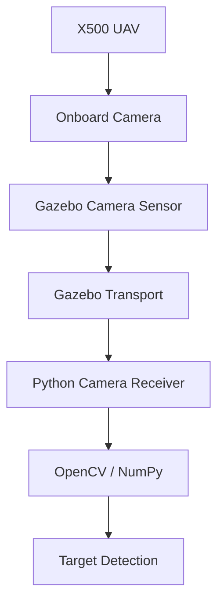
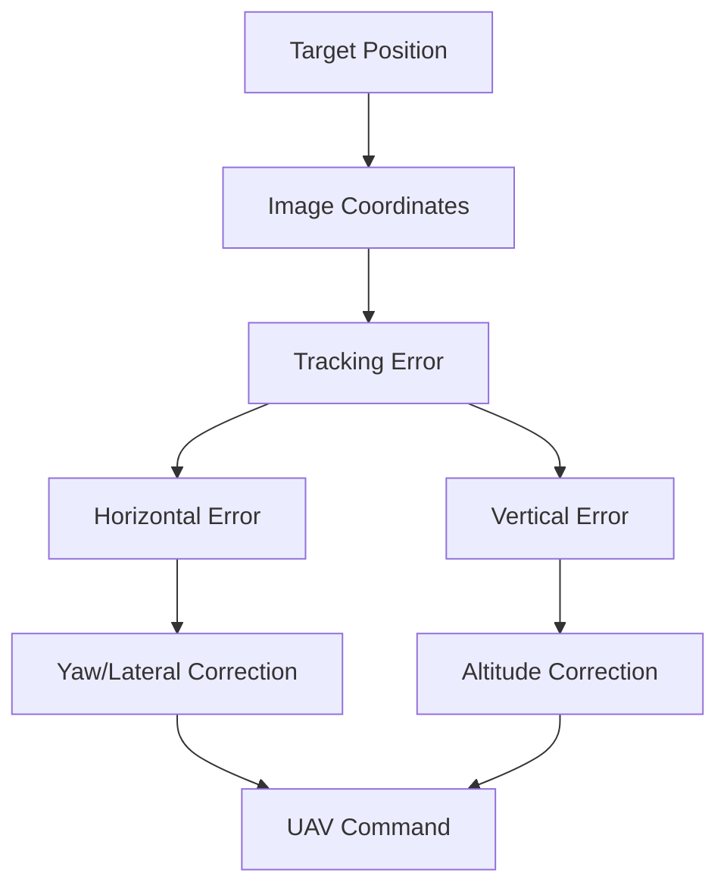

# Camera Setup

## 1. Overview

The UAV uses a simulated onboard camera to obtain visual information about the target object.

The camera provides RGB images to the tracking system.

The objective is to use the target's image position to determine how the UAV should move.

---

## 2. Camera Data Flow



---

## 3. Camera Topic

The camera topic used during development is:

```bash
/world/default/model/x500_mono_cam_0/link/camera_link/sensor/camera/image
```

---

## 4. Camera Receiver

The camera receiver is implemented in:

```bash
scripts/camera_test.py
```
The receiver creates a Gazebo Transport node:

```bash
self.node = Node()
```
and subscribes to the camera image topic.

---

## 5. Image Conversion

The incoming Gazebo image is converted into a NumPy array.

The image is then converted from RGB to BGR for OpenCV display:

```bash
frame = cv2.cvtColor(
    frame,
    cv2.COLOR_RGB2BGR
)
```

---

## 6. Camera Verification

Before integrating object tracking, the camera was tested independently.

The test verifies:

- Camera topic availability
- Successful subscription
- Image message reception
- Image dimensions
- Correct image conversion
- Live camera display

---

## 7. Object Detection

The visual tracking system uses the camera image to determine the location of the target.

Depending on the implementation, the target can be detected using color-based image processing.

The detected target is represented by image-space coordinates such as:

```bash
(cx, cy)
```
where:

- **cx** = target center x-coordinate
- **cy** = target center y-coordinate

---

8. Image-Space Tracking Error

Let the image dimensions be:

```bash
W × H
```
The image center is:

$$
c_x = \frac{W}{2}, \quad c_y = \frac{H}{2}
$$

If the detected target center is:

$$
(x_t, y_t)
$$

then the image-space tracking error is:

$$
e_x = x_t - c_x, \quad e_y = c_y - y_t
$$

These errors indicate how far the target is from the center of the camera image.

## 9. Tracking Interpretation

**Target to the right**

If:

$$
e_x > 0
$$

the target appears to the right side of the image.
The UAV controller must command an appropriate yaw or lateral correction so that the camera points toward the target.

**Target to the left**

If:

$$
e_x < 0
$$

the target appears to the left side of the image.
The controller must command the opposite correction.

## 10. Distance Estimation

The apparent size of the detected target can also provide an approximate indication of distance.

For a circular target, the detected image area can be represented as:

$$
A_{px}
$$

A larger area generally indicates that the target is closer to the camera, while a smaller area indicates that the target is farther away.

The tracking controller can therefore use target size as a distance-related feedback signal.

## 11. Tracking Control

The visual controller uses image-space errors to generate UAV commands.

Conceptually:



## 12. Camera Testing Script

The camera can be independently tested using:

```
scripts/camera_test.py
```

## 13. Troubleshooting

If no image appears:

1. Verify that Gazebo is running.
2. Verify that the X500 camera model is loaded.
3. Verify the camera topic.
4. Check that the Python environment contains the required Gazebo Transport and image-message packages.
5. Run the camera test before running the complete tracking system.