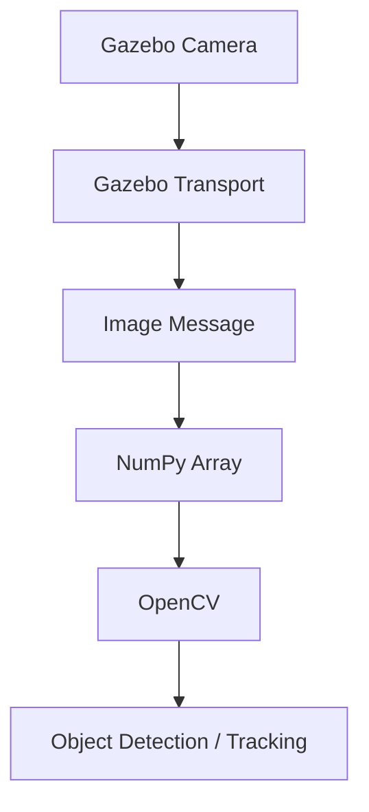
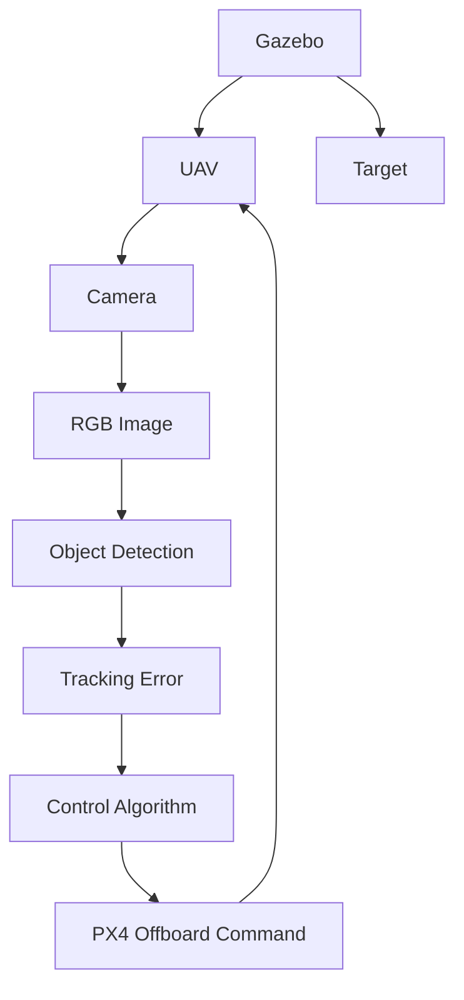

# Gazebo Setup

## 1. Overview

Gazebo Sim is used as the physics and visualization environment for the PX4 UAV simulation.

The simulated UAV is an **X500 quadcopter** controlled by PX4 SITL.

Gazebo provides:

- Physics simulation
- UAV model
- Environment
- Target object
- Camera simulation
- Sensor data

---

## 2. Launching the Simulation

The X500 simulation can be launched from the PX4-Autopilot directory using:

```bash
make px4_sitl gz_x500
```
Gazebo opens a simulation environment containing the X500 UAV.

---

## 3. Simulation Environment

The simulation contains:


The target object is used as the object that the vision-based tracking system attempts to detect and follow.

---

## 4. X500 UAV

The X500 model is used as the simulated quadcopter.

The UAV provides the platform on which the tracking controller operates.

The simulated vehicle contains a camera configuration that allows image data to be obtained from Gazebo.

---

## 5. Camera Topic

The camera used during the PX4/Gazebo experiments publishes image data through the Gazebo transport system.

The camera topic used during development was:

```bash
/world/default/model/x500_mono_cam_0/link/camera_link/sensor/camera/image
```

The Python camera receiver subscribes to this topic.

---

## 6. Camera Image Processing

The camera image is received using Gazebo Transport.

The implementation uses:

```bash
from gz.transport13 import Node
from gz.msgs10.image_pb2 import Image
```

The received image data is converted into a NumPy array and then processed using OpenCV.

The processing pipeline is:


---

## 7. Camera Testing

The following script can be used to test the Gazebo camera:

```bash
scripts/camera_test.py
```

The script:

1. Connects to the Gazebo camera topic.
2. Receives image messages.
3. Converts the image into an OpenCV frame.
4. Displays the camera output.

This was used to verify that the camera was working before integrating it with the tracking controller.

---

8. Target Object

A simulated target object is placed inside the Gazebo world.

The target can be moved using:

```bash
scripts/object_controller.py
```

The controller allows the target position to be modified interactively.

---

## 9. Target Controller

The target controller supports:

| Key | Operation |
|---|---|
| W | Move target forward |
| S | Move target backward |
| A | Move target left |
| D | Move target right |
| SPACE | Reset target |
| Q | Quit |

The controller communicates with Gazebo using the Gazebo **set_pose** service.

---

## 10. Gazebo and Tracking System

The overall pipeline is:


---

## 11. Performance Considerations

Gazebo and PX4 SITL can consume significant system resources.

During development, high CPU and memory usage was observed when running the simulation together with image processing.

Therefore:

- Close unnecessary applications when running the simulation.
- Avoid running multiple Gazebo instances simultaneously.
- Monitor system memory when testing camera-based tracking.
- Use lower camera resolution when appropriate.

---

## 12. Related Files

```BASH
px4_gazebo/
├── scripts/
│   ├── camera_test.py
│   └── object_controller.py
│
└── src/
    ├── object_tracking_drone.py
    ├── tracker_follow.py
    └── red_detector.py
```

---