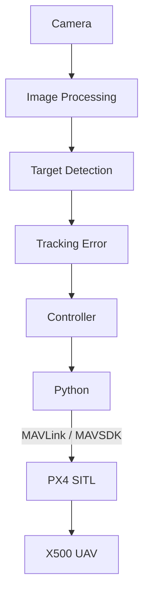

# PX4 Offboard Control

## 1. Overview

Offboard control allows an external computer program to send flight commands to PX4.

In this project, Python programs are used to generate position and velocity commands for the simulated UAV.

The purpose of Offboard control is to allow the vision-based tracking controller to directly influence the simulated UAV.

---

## 2. Control Architecture



---

## 3. Position Control

Position setpoints can be sent using MAVLink.
The project uses the local NED coordinate system.

The coordinate convention is:

```
X = North
Y = East
Z = Down
```
Therefore, an altitude of approximately 2 meters above the local origin corresponds to:

```
Z = -2
```

---


## 4. Velocity Control

Velocity control was also implemented.
The velocity command consists of:

```
vx = forward velocity
vy = right velocity
vz = downward velocity
```

---


## 5. MAVSDK Velocity Control

The MAVSDK implementation uses:

```
VelocityBodyYawspeed
```

The velocity is specified relative to the UAV body frame.

Example:

```python
await drone.offboard.set_velocity_body(
    VelocityBodyYawspeed(
        forward,
        right,
        down,
        0.0
    )
)
```

---

## 6. Smooth Velocity Changes

Abrupt changes in velocity can produce unstable UAV behavior.
Therefore, a velocity ramp was implemented.

Instead of changing directly from $v_1$ to $v_2$, the controller gradually changes the command:

$$
v(t) = v_1 + \frac{t}{T}(v_2 - v_1)
$$

where:

- $v_1$ = initial velocity
- $v_2$ = target velocity
- $T$ = ramp duration

This allows smoother acceleration and deceleration.

---

## 7. Setpoint Streaming

PX4 Offboard mode requires continuous setpoint transmission.
The controller therefore repeatedly sends commands rather than sending a single command.

The velocity test uses a control update rate of approximately:

```
20 Hz
```

This corresponds to:

$$
\Delta t = \frac{1}{20} = 0.05\ \text{s}
$$

---

## 8. Offboard Test

The basic velocity test is located at:

```
scripts/velocity_test.py
```

The test performs:

1. Connection to PX4
2. Arm
3. Initial velocity setpoints
4. Start Offboard mode
5. Vertical takeoff
6. Gradual forward acceleration
7. Velocity holds
8. Gradual deceleration
9. Stop
10. Land

---

## 9. Position-Based Offboard Test

Position-based control is implemented in:

```
scripts/offboard_control.py
```

The test demonstrates:

- PX4 connection
- Initial setpoint streaming
- Offboard mode
- Arming
- Takeoff
- Forward movement
- Position hold
- Right movement
- Landing

---

## 10. Position vs Velocity Control

Both approaches were explored during development.

**Position control**

The controller specifies a desired position:

$$
P_d = (x_d, y_d, z_d)
$$

PX4 then attempts to move the UAV toward that position.

**Velocity control**

The controller specifies:

$$
V_d = (v_x, v_y, v_z)
$$

The UAV is commanded to move at the desired velocity.

Velocity control is particularly useful for visual tracking because the desired velocity can continuously change according to the tracking error.

---

## 11. Visual Tracking Application

For object tracking, the desired velocity can be derived from visual error.

For example:

$$
v_x = f(e_d), \quad v_z = f(e_y), \quad \omega_\psi = f(e_x)
$$

where:

- $e_x$ = horizontal image error
- $e_y$ = vertical image error
- $e_d$ = distance-related error
- $\omega_\psi$ = yaw rate

The exact controller implementation is contained in the tracking source files.

---

## 12. Safety

During simulation testing:

- Keep the Gazebo window visible.
- Monitor the UAV position.
- Stop the control program if unexpected behavior occurs.
- Do not use these scripts on a physical UAV without appropriate safety validation.
- Verify coordinate-frame conventions before changing control commands.