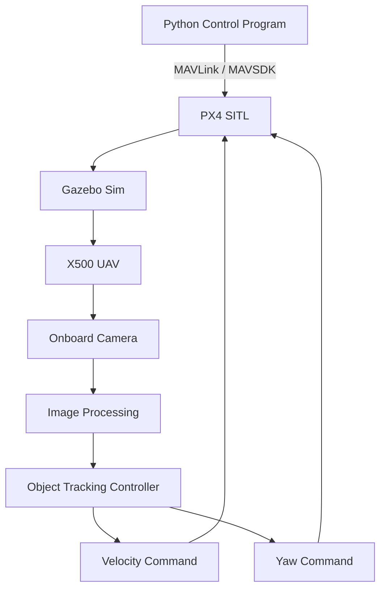

# PX4 Setup

## 1. Overview

This project uses **PX4 Autopilot** in Software-In-The-Loop (SITL) simulation.

PX4 provides the flight-control system for the simulated UAV. The UAV is operated in simulation without requiring a physical drone.

The PX4 simulation environment was configured inside **WSL2 Ubuntu 24.04** on Windows.

---

## 2. Software Environment

The main software components used in the PX4 simulation are:

| Component | Version / Environment |
|---|---|
| Operating System | Windows |
| Linux Environment | WSL2 |
| Linux Distribution | Ubuntu 24.04 |
| PX4 | PX4-Autopilot |
| Simulator | Gazebo Sim |
| Gazebo Version | 8.14.0 |
| Ground Control Station | QGroundControl |
| Programming Language | Python |
| Python environment | Conda / Python virtual environments / GNU nano 7.2 |

---

## 3. PX4-Autopilot

The PX4-Autopilot source code was cloned into the WSL2 Ubuntu environment and built for SITL simulation.

The PX4 repository is used as the flight-control software for the simulated UAV.

The project uses the **X500 quadcopter model** for the simulation.

---

## 4. Building PX4 SITL

After configuring the PX4 environment, the X500 simulation can be launched using:

```bash
make px4_sitl gz_x500
```
This starts:
1. PX4 SITL
2. Gazebo Sim
3. The simulated X500 UAV
4. The communication interface required for external control

---

## 5. PX4 Flight Control

The project experiments with several types of UAV control:

- Position control
- Velocity control
- Offboard control
- Visual feedback control
- Object-following control

Python programs are used to communicate with PX4 and send commands to the simulated UAV.

---

## 6. Offboard Control

The project uses external Python programs to send commands to PX4.

Two communication approaches were explored:

**MAVSDK**

MAVSDK was used for velocity-based UAV control.

Example:

```bash
await drone.offboard.set_velocity_body(...)
```
This allows the Python controller to send body-frame velocity commands to the UAV.

**Pymavlink**

Pymavlink was also used to communicate directly with PX4.

Position and velocity setpoints can be sent using MAVLink messages such as:

```bash
set_position_target_local_ned_send(...)
```

---

## 7. QGroundControl

QGroundControl was installed on Windows and used to monitor the PX4 SITL vehicle.

It provides information such as:

- Vehicle connection
- Arming state
- Flight mode
- Pre-arm status
- Vehicle position
- Flight status
- PX4 messages

The QGroundControl application was connected to the PX4 instance running inside WSL2.

---

## 8. PX4 Simulation Architecture

The PX4 portion of the project follows this general architecture:



---

## 9. Verification

The PX4 environment was considered operational when:

- PX4 SITL launched successfully.
- Gazebo displayed the X500 UAV.
- QGroundControl detected the simulated vehicle.
- The vehicle could be armed after satisfying PX4 pre-flight checks.
- Position and velocity commands could be sent from Python.
- The UAV responded to external control commands.

---

## 10. Related Source Code

PX4/Gazebo source code is organized as:

```bash
px4_gazebo/
├── src/
│   ├── center_tracking_drone.py
│   ├── drone_control.py
│   ├── object_tracking_drone.py
│   ├── red_detector.py
│   ├── tracker_follow.py
│   ├── visual_controller.py
│   └── visual_velocity_controller.py
│
└── scripts/
    ├── camera_test.py
    ├── connection_test.py
    ├── object_controller.py
    ├── offboard_control.py
    └── velocity_test.py
```

---

## 11. Important Notes

PX4 Offboard mode requires continuous setpoint transmission.

If setpoints stop being sent, PX4 may leave Offboard mode or trigger failsafe behavior.

Therefore, control programs in this project continuously stream commands rather than sending a single command and waiting.

---

## 12. Troubleshooting

Common PX4 issues encountered during development are documented in:

```bash
TROUBLESHOOTING.md
```

---