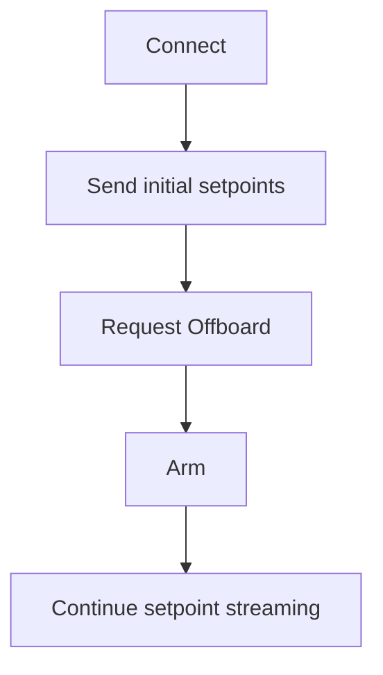
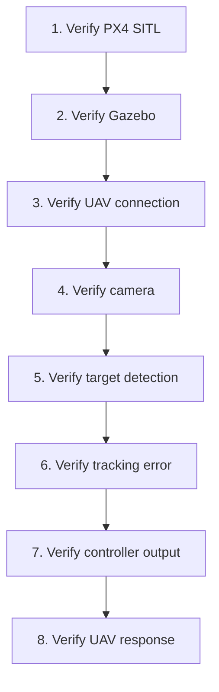

# Troubleshooting

This document records important issues encountered while developing the PX4/Gazebo object-tracking simulation.

---

# 1. QGroundControl Not Connecting

## Problem

QGroundControl initially did not detect the PX4 SITL vehicle running inside WSL2.

## Investigation

The PX4 simulation was running inside WSL2 while QGroundControl was running on Windows.

Therefore, communication between the WSL2 environment and Windows had to be established correctly.

## Resolution

The PX4 connection was configured so that QGroundControl could communicate with the PX4 SITL instance.

After the connection was established, QGroundControl was able to display the simulated vehicle.

---

# 2. Arming Denied

## Problem

PX4 reported:

```text
Arming denied: Resolve system health failures first
```
**Cause**

PX4 performs pre-flight checks before allowing the vehicle to arm.

**Resolution**

The PX4 health and pre-arm conditions were monitored through QGroundControl and PX4 status messages.
Once the required conditions were satisfied, the vehicle became armable.

---

## 3. Offboard Mode Problems

**Problem**

The UAV did not always enter Offboard mode correctly.

**Cause**

PX4 requires external setpoints to be streamed before and during Offboard operation.
A control program that sends a single command and then waits may not satisfy the Offboard requirements.

**Resolution**

The controller was modified to continuously stream setpoints.

The general procedure became:



---

## 4. Velocity Control Instability

**Problem**

The UAV was unstable when velocity commands changed too abruptly.

**Cause**

Sudden velocity changes produce aggressive acceleration responses.

**Resolution**

Velocity ramping was introduced.

Instead of directly changing:

```
0.0 m/s -> 0.8 m/s
```

the controller gradually increases the velocity.

The velocity test therefore uses intermediate values such as:

```
0.0 -> 0.2 -> 0.4 -> 0.6 -> 0.8 m/s
```

and then gradually reduces the velocity.

---

## 5. Camera Topic Problems

**Problem**

The Python program initially had difficulty receiving camera images.

**Investigation**

The Gazebo camera topic was identified as:

```
/world/default/model/x500_mono_cam_0/link/camera_link/sensor/camera/image
```

**Resolution**

The Python camera receiver was configured to subscribe to the correct Gazebo Transport topic.
The camera was then tested independently before integrating it with the object tracker.

---

## 6. UAV Turning in the Wrong Direction

**Problem**

During early object-tracking experiments, when the target moved to one side of the camera frame, the UAV sometimes rotated away from the target instead of turning toward it.

**Cause**

This was related to the sign convention used for the image-space tracking error and yaw command.

For horizontal tracking:

$$
e_x = x_t - \frac{W}{2}
$$

where:

- $x_t$ is the target center
- $W/2$ is the image center

The sign of the controller output must correspond correctly to the UAV's yaw direction.

**Resolution**

The tracking controller was adjusted so that a target appearing on the right side of the image produces a correction toward the right side rather than an opposite correction.

---

## 7. Gazebo Resource Usage

**Problem**

Gazebo and PX4 SITL consumed a significant amount of system memory.

**Symptoms**

The simulation could become slow or crash when the system was under heavy memory pressure.

**Resolution**

During testing:

- Unnecessary applications were closed.
- Multiple Gazebo instances were avoided.
- System memory usage was monitored.
- Simulation complexity was kept under control.

---

## 8. Python Environment Issues

Different parts of the project use different Python packages and environments.

The PX4/Gazebo scripts use packages including:

```
pymavlink
mavsdk
opencv-python
numpy
```

Gazebo camera communication also requires the appropriate Gazebo Transport and message Python modules.

The PyBullet simulation has its own requirements file:

```
simulation/pybullet/requirements.txt
```

The PX4/Gazebo environment has a separate requirements file:

```
simulation/px4_gazebo/requirements.txt
```

Keeping these environments separated helps avoid dependency conflicts.

---

## 9. General Debugging Procedure

When a new tracking problem occurs, the following order is recommended:



This prevents problems in one subsystem from being incorrectly attributed to another subsystem.

## 10. Important Lesson

The project was developed incrementally.

The final tracking system was obtained by independently validating:

- Simulation
- UAV communication
- Camera
- Target detection
- Control
- Tracking

This modular debugging approach makes it easier to identify and correct failures in the complete UAV tracking system.